# Final_sertification_2_task

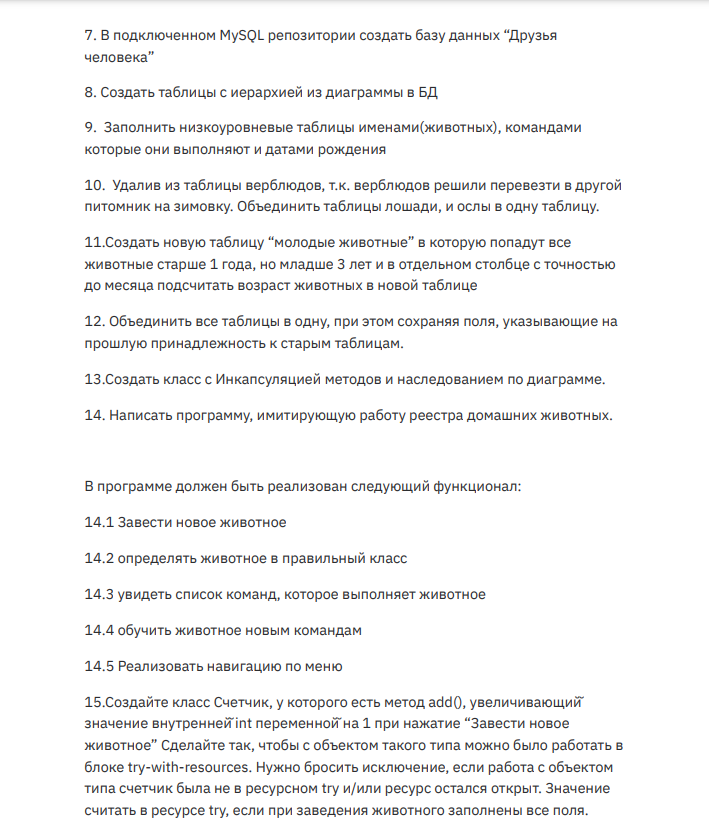

1. 
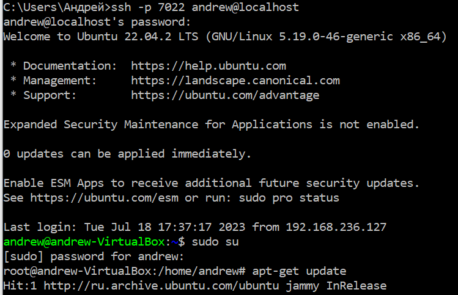

2. 
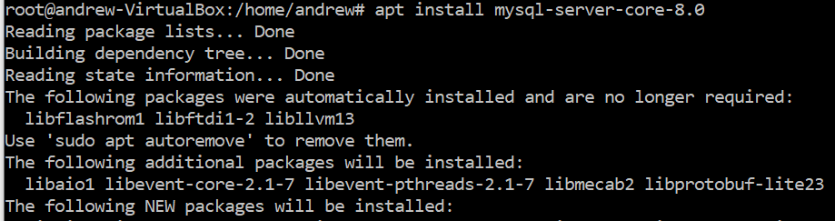

3. Установка и удаление deb-пакета с помощью dpkg
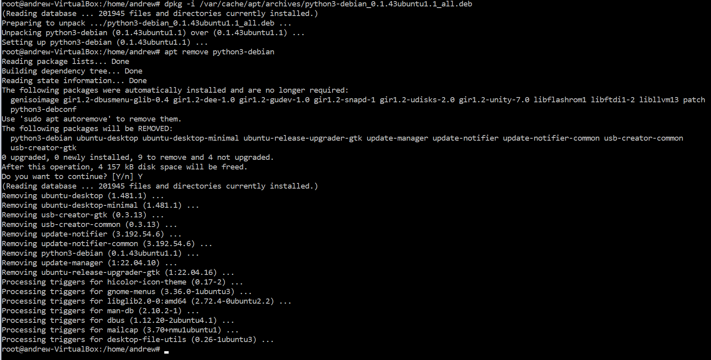

3. 
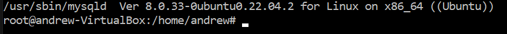

4. 
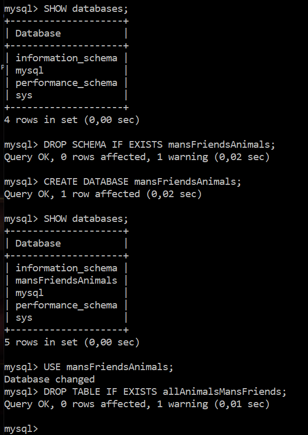

5. 
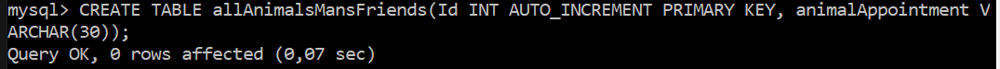

6. 
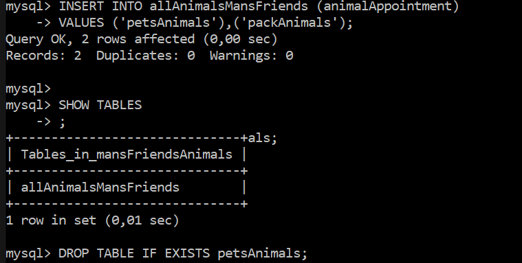

7. 
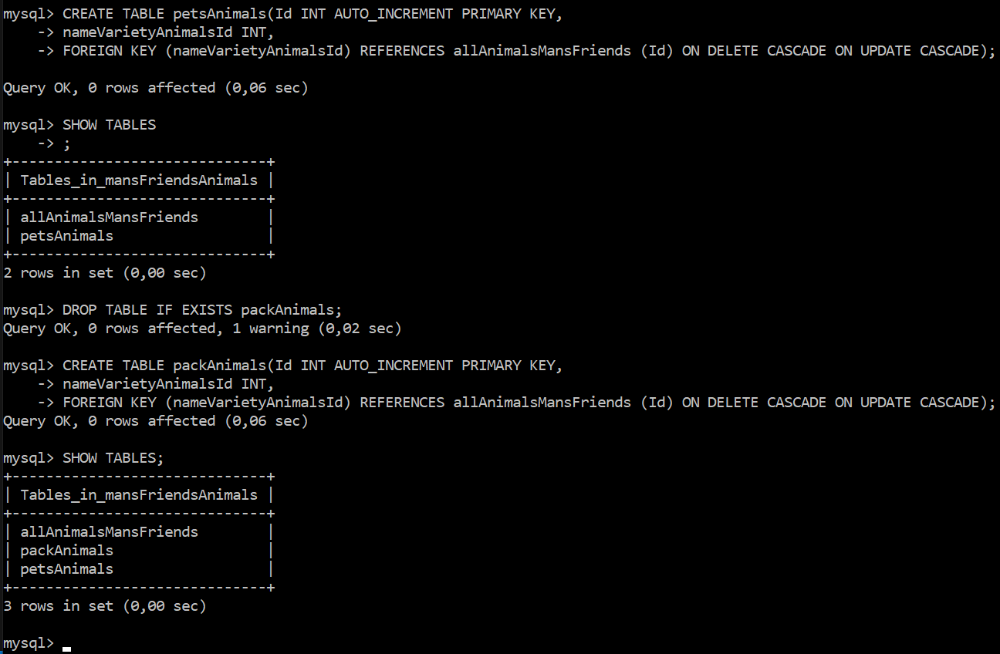

8. 

9. 
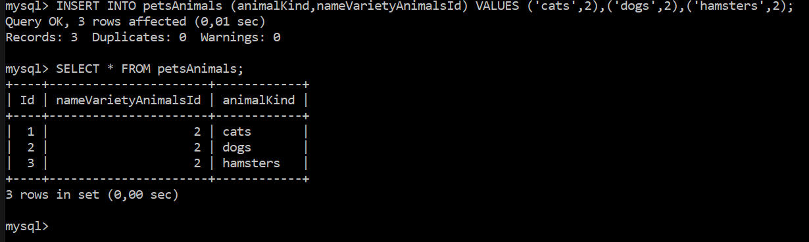

10. 
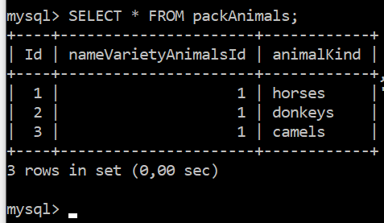

11. 
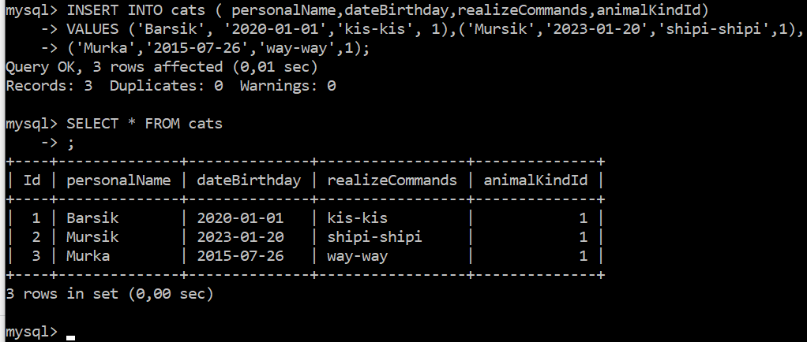

12. 
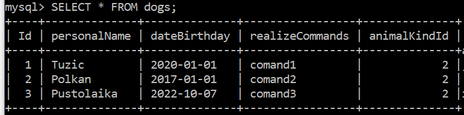

13. 
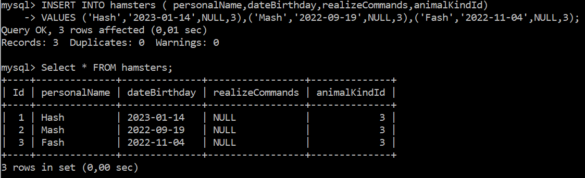

14. 
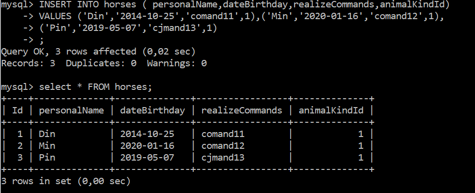

15. 
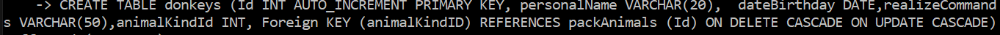

16. 
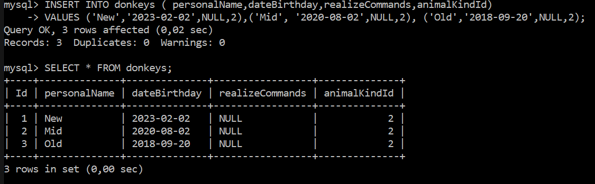

17. 
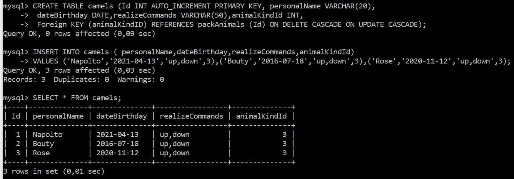

18. 
Удалить из таблицы верблюдов, т.к. верблюдов решили перевезти в другой питомник на зимовку. 

SET SQL_SAFE_UPDATES = 0;
DELETE FROM camels;

Команда показана, но не выполнялась в учебных целях

19. 
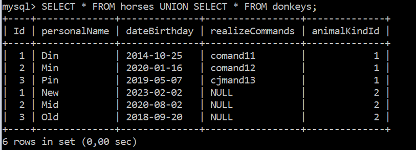

20. 
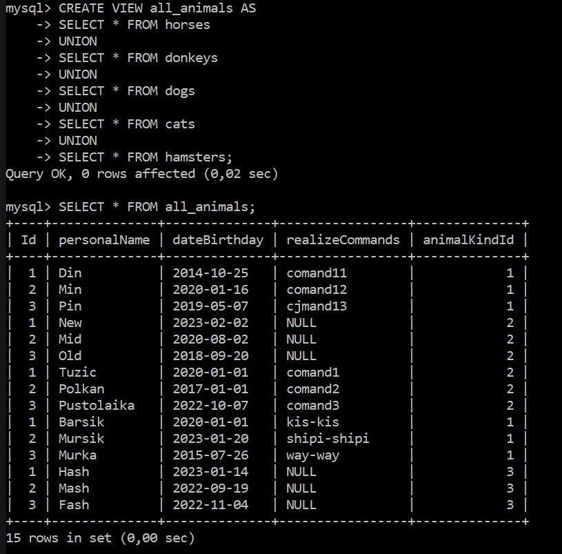

21. 
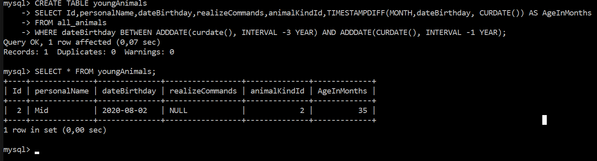
