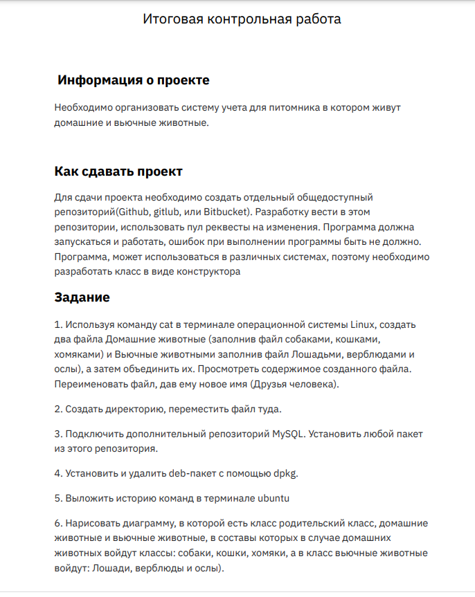

# Final_sertification_2_task

---
---

#  Работа с mysql

1. Проброс портов.

2. Установка mysql-server

3. Установка и удаление deb-пакета с помощью dpkg

4. Запуск mysql

5. Создание и заполнение таблицы "верхнего" уровня животные-друзья-человека

 

6. Создание таблиц вьючные и домашние питомцы

 

7. Создание (не показано) и заполнение таблицы домашние животные

8. Создание (не показано) и заполнение таблицы вьючные животные

9. Создание (не показано) и заполнение таблицы кошки

10. Создание (не показано) и заполнение таблицы собаки

11. Заполнение таблицы хомяки

12. Заполнение таблицы лошади

13. Создание и заполнение таблицы ослы

 

14. Создание и заполнение таблицы верблюды

15. Удаление из таблицы верблюдов, т.к. верблюдов решили перевезти в другой питомник на зимовку. 

SET SQL_SAFE_UPDATES = 0;
DELETE FROM camels;

Команда показана, но не выполнялась для дальнейших учебных целей

16. Объединенная таблица с лошадьми и ослами

17. Объединенная таблица со всеми животными кроме верблюдов

18. Выборка животных возрастом от 1 года до 3 с указанием 
возраста в месяцах.

18. Объединение всех таблиц в одну с указанием исходной таблицы

 

19. Диаграмма классов

---
---
# Работа с терминалом.

20. Использование команды cat , mkdir , mv , ls

21. Демонстрация работоспособности программы

